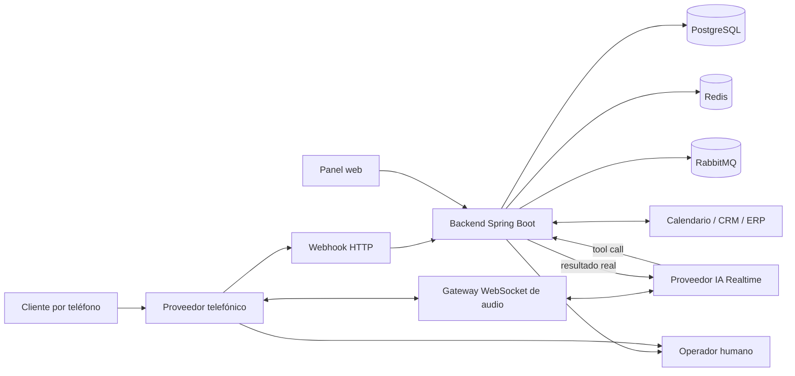
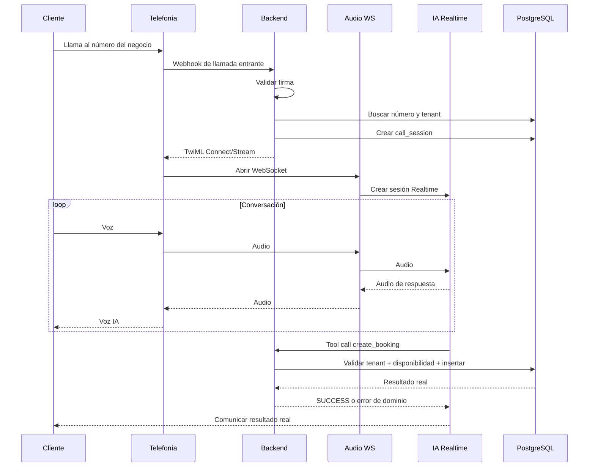
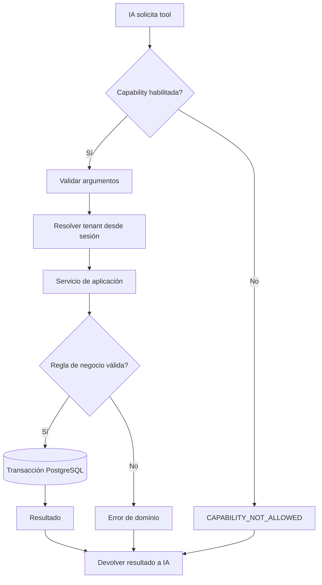
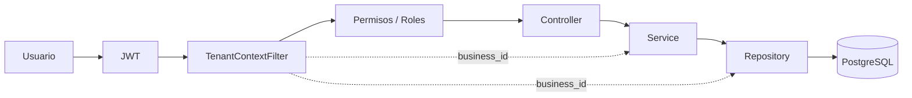
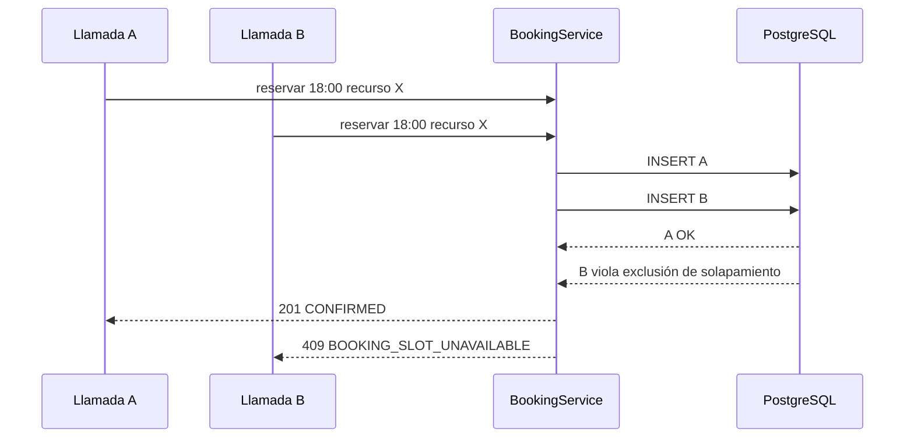
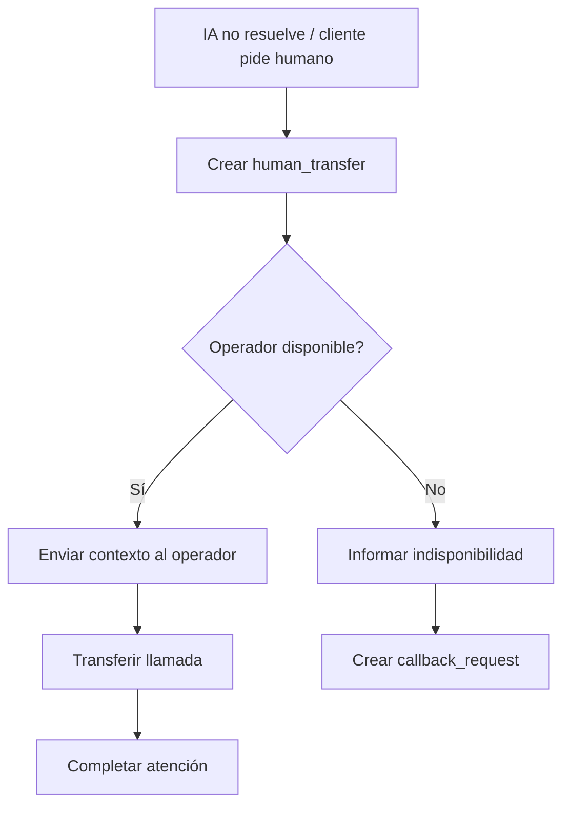

# Helvoca - Diagramas técnicos de texto

## 1. Arquitectura de producción

## 2. Secuencia de llamada

## 3. Tool call controlada

## 4. Seguridad multi-tenant

Regla: el frontend no decide el tenant. `business_id` se toma de la identidad autenticada.

## 5. Reserva concurrente

## 6. Transferencia humana

