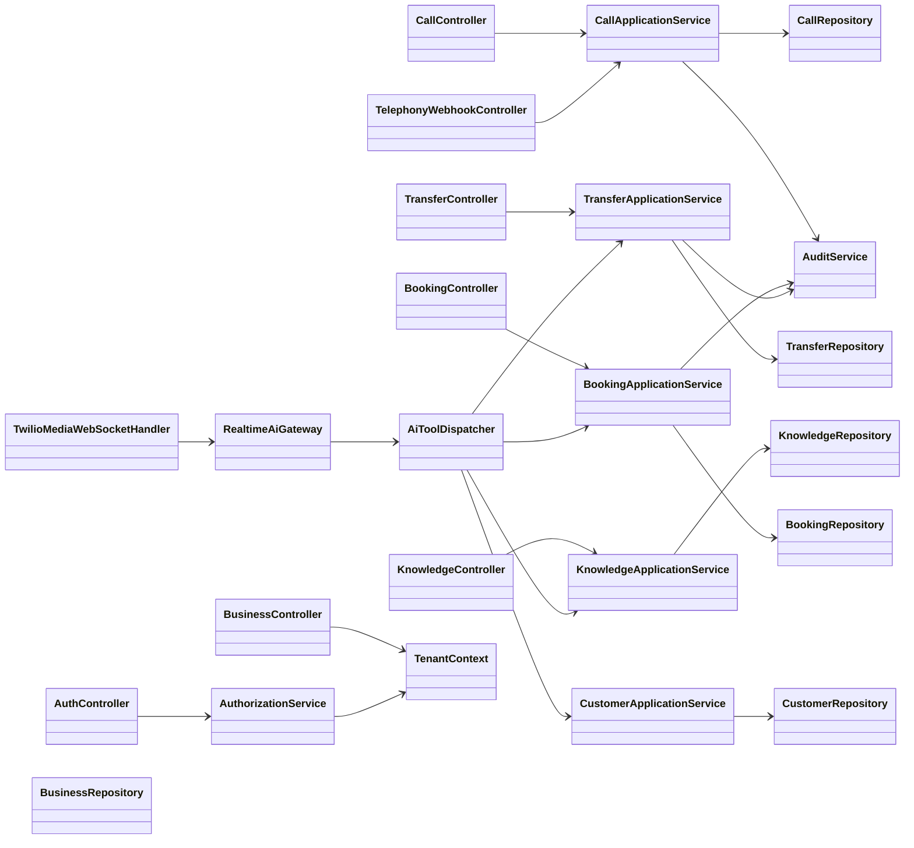

```mermaid
classDiagram
direction LR

class AuthController
class BusinessController
class CallController
class BookingController
class KnowledgeController
class TransferController
class TelephonyWebhookController
class TwilioMediaWebSocketHandler
class RealtimeAiGateway
class AiToolDispatcher

class TenantContext
class AuthorizationService
class CallApplicationService
class BookingApplicationService
class KnowledgeApplicationService
class TransferApplicationService
class CustomerApplicationService
class AuditService

class BusinessRepository
class CallRepository
class BookingRepository
class KnowledgeRepository
class CustomerRepository
class TransferRepository

AuthController --> AuthorizationService
BusinessController --> TenantContext
CallController --> CallApplicationService
BookingController --> BookingApplicationService
KnowledgeController --> KnowledgeApplicationService
TransferController --> TransferApplicationService

TelephonyWebhookController --> CallApplicationService
TwilioMediaWebSocketHandler --> RealtimeAiGateway
RealtimeAiGateway --> AiToolDispatcher

AiToolDispatcher --> BookingApplicationService
AiToolDispatcher --> KnowledgeApplicationService
AiToolDispatcher --> CustomerApplicationService
AiToolDispatcher --> TransferApplicationService

CallApplicationService --> CallRepository
BookingApplicationService --> BookingRepository
KnowledgeApplicationService --> KnowledgeRepository
CustomerApplicationService --> CustomerRepository
TransferApplicationService --> TransferRepository

CallApplicationService --> AuditService
BookingApplicationService --> AuditService
TransferApplicationService --> AuditService

AuthorizationService --> TenantContext
```
